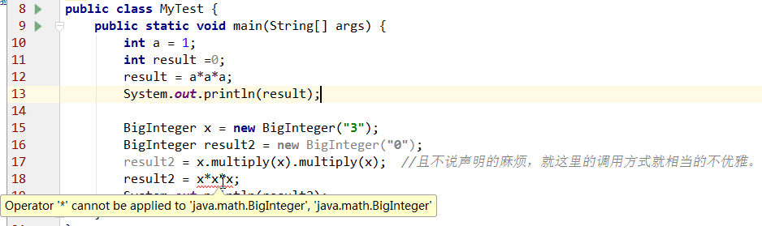
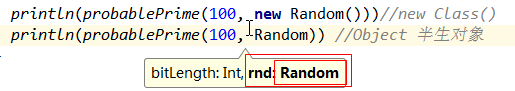

# Scala入门圣典 第一章 快速体验、常用类型、操作符

作者：冯琪超

[toc]

### REPL
Read Evaluate Print Loop
scala的命令窗口并不是真正的解释器，而是快速的编译为java字节码，由jvm执行。
能够很快的将执行结果返回到命令行窗口，REPL的叫法对于scala程序员更为亲切。
同时，当程序更为复杂的时候，文本编辑器将会是另一种选择。
当涉及到产品工程时，IDE将会有大用场。

在repl中时可以使用 `.`触发大部分常用Api的提示。例如String类的**distinct**方法就没有提示【实际上没有是因为隐式转换，本不是该类的功能】

## 快速体验

```scala
scala> 8*4+2
res1: Int = 34

scala> res1+2.1
res2: Double = 36.1

scala> "hello, " + res2
res4: String = hello, 36.1

scala> res
res1   res2   res3   res4   

scala> res4
res5: String = hello, 36.1

scala> res4.to
toCharArray   toLowerCase   toString      toUpperCase   

scala> res4.toUpperCase
res6: String = HELLO, 36.1
```

### 字符串与数组的转换
 val word = "hello world"
#### 将字符串转为数组
```scala
    //string to array
    val arr = word.toArray
    println(arr)
```

#### 字符数组转为字符串
```scala
    //array to string
    print(arr.mkString)
```


## 常用类型、操作符

### 1. 声明值和变量
#### 声明的两种方式

```scala
val a = 1 //值不可改变       **值 value
var b = 2 //值可以修改   **变量 variable
```

推荐使用val的方式，大多数程序并不需要那么多的var变量。

在REPL中的res变量默认是val还是var型的呢？
下面代码证明为val
```scala
scala> 3
res33: Int = 3

scala> res33=5
<console>:8: error: reassignment to val
       res33=5
            ^
```
#### 类型自动推断
##### 不带类型声明
看这段代码
```scala
scala> val a = 1
a: Int = 1

scala> var b = "hello scala"
b: String = hello scala
```
可以清晰的看到变量或值的类型声明为Int和String

scala的类型推断为我们写程序带来了很多遍历，但有时为了更加清晰明了，方便阅读（似乎矛盾），可以加上。

tips:Intelli Idea 使用ctrl+alt+v 和变量定义很配....
##### 加上类型声明

```scala
a: String = hello world

scala> var b: Int = "1"  //如果声明了类型，值当然需要对应上，否则error
<console>:7: error: type mismatch;
 found   : String("1")
 required: Int
       var b: Int = "1"
                    ^
```
#### 类型总是写在变量或函数的后面
Note: scala的变量或函数的**类型总是写在变量或函数的后面**，是为了方便阅读更加复杂的类型声明。

String greeting   //C风格
greeting: String  //更加人性化的风格

```scala
scala> val arr: Array[Int] = Array(1,2)
arr: Array[Int] = Array(1, 2)
```

#### 同时声明多个值或变量

```scala

 val x,y = 3 //x=3,y=3
 
 var x,y: String = null
	x: String = null
	y: String = null

 val a,b = (3,4)  //a=(3,4),b=(3,4)

```

### 2. 常用数据类型
scala如java一样同样具有7个数值类型，一个Boolean类型。与Java不同的是，**这些类型都是类**。**Scala并不刻意区分基本类型与引用类型。**

####  Scala数据类型都是类
```scala
scala> 1
res3: Int = 1

scala> 1.toString
res4: String = 1

scala> 1.toString()
res5: String = 1
```
注意:1.toString 省略了 "()" Scala语言中方法无参时可以省略 "()"。
例如： 

```scala
scala> "Hello".distinct  //获取字符串中不重复的字符
res6: String = Helo
```

#### 类型增强
类型增强是针对Java数据类型的增强，**Scala通过隐式转换方式对Java常用的数据类型增加了其不具有的方法**，使其使用起来更加灵活多变。

##### 1. RichInt ->对Int的隐式转换
```scala
scala> 1.to
toByte     toChar     toDouble   toFloat    toInt      toLong     toShort    toString   

scala> 1.to(10)
res6: scala.collection.immutable.Range.Inclusive = Range(1, 2, 3, 4, 5, 6, 7, 8, 9, 10)

scala> 1 to 10
res7: scala.collection.immutable.Range.Inclusive = Range(1, 2, 3, 4, 5, 6, 7, 8, 9, 10)
```
1. `1.to`后敲击tab键，并不会显示出该类型的所有方法，但通常情况下常用的都会有。没有的可以查api文档。 
2. `1` 先被转换成了RichInt类，再应用to方法，这正体现了对Int隐式转换，使用了其没有的方法。
3. **严重注意第一条，没有显示的真正原因是真的没有该方法，能够使用看似是本类有的方法，实则无的是因为Scala的隐式转换**
##### 2. StringOps ->对String的隐式转换

```scala
scala> "hello".in
indexOf   intern    

scala> "hello".intersect("world") //两单词中都出现过的字符
res11: String = lo

scala> "world".intersect("hello") 
res12: String = ol
```

对于其他类型，Scala都有相应的增强，可以细看下。

#### 类型转换
##### 1. 方法转换
Scala的类型转换**都是使用方法转换**的，而**非Java的强制类型转换**。

```scala
scala> 100.00.toInt
res13: Int = 100

scala> 100.00.toString
res14: String = 100.0

scala> 100.32.toInt
res15: Int = 100

scala> 100.32.toChar
res16: Char = d

scala> 100.toDouble
res18: Double = 100.0
```

##### 2. 字符串转换数值时的注意
注意下面内容 ： 将**包含数字的字符串转换为数值**，要遵守字面值的类型是什么类型，就**要转换为相应的类型，否则将转换出错**。
```scala
scala> "99.99".toInt
java.lang.NumberFormatException: For input string: "99.99"
        at java.lang.NumberFormatException.forInputString(NumberFormatException.java:65)
        at java.lang.Integer.parseInt(Integer.java:492)
        at java.lang.Integer.parseInt(Integer.java:527)
        at scala.collection.immutable.StringLike$class.toInt(StringLike.scala:229)
     

scala> "99.99".toDouble
res20: Double = 99.99

scala> "99.9".toInt
java.lang.NumberFormatException: For input string: "99.9"
        at 
scala> 

scala> "99".toInt
res22: Int = 99

scala> 99.99.toInt
res23: Int = 99

scala> "99.9".toInt
java.lang.NumberFormatException: For input string: "99.9"
        at 

scala> "99.0".toFloat
res26: Float = 99.0
   
```

### 3. 算数与操作符重载
与其他语言的用法及效果是一样的。
一点特别的是：
#### 操作符都是方法

```scala
scala> var a = 1+2
a: Int = 3

scala> var a = 1.+(2)
warning: there were 1 deprecation warning(s); re-run with -deprecation for details
a: Double = 3.0
```

#### BigInt的特殊方法 /%

`BigInt中的/%` 方法的结果为`(商，余数)`的`对偶`

注意：BigInt类型的声明 最舒服的方式是显示指定类型，不要各种转换了..
```scala
scala> 5/3
res27: Int = 1

scala> 5%3
res29: Int = 2


scala> 5./%(3)
<console>:8: error: value /% is not a member of Double
              5./%(3)
                ^
                
scala> 5.toBigInt  //注意不要和隐式转换混淆
<console>:8: error: value toBigInt is not a member of Int
              5.toBigInt
                ^

scala> val a: BigInt = 5 //特别指明类型
a: BigInt = 5

scala> a.
%                 &                 &~                *                 +                 -                 /                 /%                >                 >=                            
.....                

scala> a./%(3) //a是BigInt类型的，编译才过
res37: (scala.math.BigInt, scala.math.BigInt) = (1,2)
```
[官网BigInt API参考](http://www.scala-lang.org/api/2.7.4/scala/BigInt.html)


#### 方法写法风格

```scala
scala> 1.to(10)
res41: scala.collection.immutable.Range.Inclusive = Range(1, 2, 3, 4, 5, 6, 7, 8, 9, 10)

scala> 1 to 10
res42: scala.collection.immutable.Range.Inclusive = Range(1, 2, 3, 4, 5, 6, 7, 8, 9, 10)


scala> 1.+(2)
warning: there were 1 deprecation warning(s); re-run with -deprecation for details
res39: Double = 3.0

scala> 1+2
res40: Int = 3
```
.+方法名C的风格与DSL风格那种都可以，但`1.+(2)` 与`1+2`你会采取哪种写法呢？

#### 无++ - - ，能用+=1,-=1

```scala
scala> var a = 2 //这里标识var，标明可以赋值
a: Int = 2

scala> a++ //从错误提示上看 压根就没提供++操作符或方法
<console>:9: error: value ++ is not a member of Int
              a++
               ^

scala> a+=1 // a=a+1

scala> a
res52: Int = 3


//那看val类型的定义
scala> val y = 1
y: Int = 1

scala> y++
<console>:9: error: value ++ is not a member of Int
              y++
               ^

scala> y+=1
<console>:9: error: value += is not a member of Int
              y+=1
               ^

```

Scala没有`++,--`,**因为Int类是不 可变的**，实现++不那么简单，并且Scala设计者也认为**不应该为了少按一个键而额外的增加一个特例**。

#### 操作符重载
Scala写法
```scala
scala> var x =2
x: Int = 2

scala> x*x*x
res1: Int = 8
```
Java写法
```java
import java.math.BigInteger;

public class Test{
	public static void main(String[] args){
		BigInteger x = new BigInteger("3");
		BigInteger result = new BigInteger("0");
		result = x.multiply(x).multiply(x);  //且不说声明的麻烦，就这里的调用方式就相当的不优雅。
		System.out.println(result);
	}
}
```



**Java中不能对操作符进行重载**。目的是为防止出现%^&..奇特操作符，不利于阅读。Scala的设计者认为Java对操作符的重载理念很糟糕，理由是按照Java设计者的逻辑，qwxes这类的方法名同样难以阅读。
**Scala允许程序员自定义操作符，当然程序员获得自由的同时，也需要把握好分寸。**


#### 调用函数
方法的调用，之前的案例已经演示很多次了。
这次说下函数的调用。 Scala是**多范式的**一门编程语言，**函数更是其一等公民**。
函数在Scala语言扮演着举足轻重的角色。


##### 数学函数
在Scala中使用数学函数比在Java中方便地多---不需要从某个类中调用它的静态方法。
**使用数学函数时，注意先导包**
```scala
scala> pow(2,3)
<console>:8: error: not found: value pow
              pow(2,3)
              ^

scala> import math._  //注意导包
import math._

scala> pow(2,3)
res1: Double = 8.0

scala> min(2,Pi)
res2: Double = 2.0

scala> max(3.15,Pi)
res3: Double = 3.15

scala> sqrt(9)
res4: Double = 3.0
```
##### Scala中无静态方法---伴生对象的存在
Scala中不像Java中调用Math包中的数学静态工具类去调用一堆静态方法，
**Scala中没有静态方法**，但其有单例对象，通常Scala的类都有一个伴生对象，该对象中的方法都是静态的。
例如：BigInt的伴生对象BigInt有个生成指定位数的随机素数的方法probablePrime.


```scala
scala> BigInt.probablePrime
       def probablePrime(bitLength: Int, rnd: scala.util.Random): BigInt   

scala> BigInt.probablePrime
       def probablePrime(bitLength: Int, rnd: scala.util.Random): BigInt   

scala> BigInt.probablePrime(100,scala.util.Random)
res5: scala.math.BigInt = 1039784749608415333365855987893
```

```scala
import scala.BigInt._
import scala.util.Random

println(probablePrime(100, new Random()))//new Class()
println(probablePrime(100, Random)) //Object 半生对象
```


### 4. 使用伴生对象的apply方法
Scala中使用函数调用的方式非常常见。例如：

```scala
scala> "hello"(0)
res2: Char = h

scala> "hello"(5)  //同样不能够下标越界
java.lang.StringIndexOutOfBoundsException: String index out of range: 5
        at java.lang.String.charAt(String.java:658)
        .......
```
助记：()方法重载为(n: Int)
实际上背后的实现原理为apply()方法

```scala
scala> "hello".apply(1)  //简写为 "hello"(1)  apply(n:Int)
res5: Char = e
```
StringOps类中方法定义


**使用伴生对象apply方法生成对象是Scala中常用的手法。**
以后会经常用到的**数组生成方式**

```scala
scala> Array(1,2,3,4)
res9: Array[Int] = Array(1, 2, 3, 4)

scala> res9(10)
java.lang.ArrayIndexOutOfBoundsException: 10
    ......
    
scala> Array(1 to 10)
res12: Array[scala.collection.immutable.Range.Inclusive] = Array(Range(1, 2, 3, 4, 5, 6, 7, 8, 9, 10))

val inclusives: Array[Inclusive] = Array(1 to 10,1 to 20)//需要注意的是目前的Array对象中只生成了一个元素而已 
println(inclusives.length) //2
println(inclusives(1)) //Range(1, 2, 3, 4, 5, 6, 7, 8, 9, 10, 11, 12, 13, 14, 15, 16, 17, 18, 19, 20)

for (elem <- inclusives) {
   println(elem)  //Range(1, 2, 3, 4, 5, 6, 7, 8, 9, 10)
   //Range(1, 2, 3, 4, 5, 6, 7, 8, 9, 10, 11, 12, 13, 14, 15, 16, 17, 18, 19, 20)
  }
}

```

### 5. 函数作为参数
Scala中函数作为参数传入方法相当普遍。
在StringOps方法中count方法接收单个Char并可以返回Boolean类型结果的函数
`def count(p: (Char) => Boolean): Int`
```scala
scala> "heLLLo".count(_.isUpper)
res29: Int = 3
```
注意`_`是Scala语法中的精妙用法，其完整写法为

```scala
scala> "heXXXo".count(x=>x.isUpper)
res31: Int = 3
```
注意能直接就直接，

```scala
scala> "heXXXo".map(_.toString.toUpperCase) //map(t) t元素是char类型
res25: scala.collection.immutable.IndexedSeq[String] = Vector(H, E, X, X, X, O)

scala> "heXXXo".toUpperCase
res1: String = HEXXXO
```


