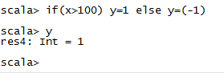
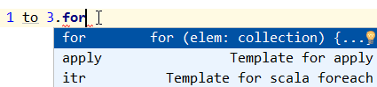

##  Scala入门圣典 第二章 表达式、语句、控制结构

作者：冯琪超
微信 : 152 010 98976  

[toc]
## 表达式与语句
在Java或其他语言中，表达式和语句是本质区别的。表达式有值(例如1+1)，语句执行动作(例如if语句)。 
Scala语言则有很大的不同，**几乎任何被构造出来的语法结构都有值**。正是因为有了该特性，Scala程序才会更加精简易读。

### 1. if表达式的值
更确切的说是if表达式执行后的结果返回值。

注意下面的程序，有以下几点需要注意
1. var类型的定义场景。第一种写法更好是因为可以直接定义val值，而第二种写法则是必须定义为var
2. 代码格式化
3. 尽量不要在最后的语句中赋值变量，否则语句的值就变得没什么意义了，最好将语句赋值给变量或值。
#### 两种形式
**第一种形式**
```scala
val x = 101
scala> if(x>100) 1 else -1
res34: Int = 1

scala> if x>100 1 else -1   //注意不要写嗨了连if后的（）后省略了。这里真不能省
<console>:1: error: '(' expected but identifier found.
       if x>100 1 else -1
          ^
val result = if (a > 100) 1 else -1;
    println(result) //1
```
在Scala中是避免使用return的。
上面的写法是原汁原味的，尽量不要写出类似Java的用法了


**第二种形式**
```
scala> val y = 0
y: Int = 0

scala> if(x>100) y=1 else y=-1
<console>:10: error: reassignment to val
              if(x>100) y=1 else y=-1
                         ^
<console>:10: error: value =- is not a member of Int
              if(x>100) y=1 else y=-1
                                  ^


scala> var y = 0
y: Int = 0

scala> if(x>100) y=1 else y=-1
<console>:10: error: value =- is not a member of Int
              if(x>100) y=1 else y=-1
                                  ^

scala> if(x>100) y=1 else y= -1

scala> y
res42: Int = 1
```


#### 与三目运算符的对比
`int m = 0; m = m>1? 1:-1; ` Java中三目运算符`?:`，与上面的代码效果是一样的，反而更加精简，但是`?:`不能再插入语句。

可以说是Scala中将if else与三目运算结合起来了。并且威力更加强大了，例如可以混合类型的表达式

```scala
scala> val x = 1
x: Int = 1

scala> if (x>0) "positive" else -1
res43: Any = positive
```

#### 返回值类型

 **if语句的返回值类型是String与Int类型的公共超类型Any**
 
```scala
scala> if (x>0) "positive" else -1
res43: Any = positive
```
`"positive" ->java.lang.String`  
`-1-> Int`
  

#### Unit ()
如果else缺失，而if条件又不满足
语句的返回值类型将是Unit, 写作: ()，相当于Java中的void。
但是**本质上还是有些区别**，Unit代表“无有用值”，而void是空的，类比：空的钱包(void)与一张写有“没钱”的无面值(unit)的钞票。

```scala
scala> val x = 99
x: Int = 99

scala> if (x>100) 1 
res0: AnyVal = ()
```

其实相当于
```scala
scala> if (x>100) 1 else () 
res0: AnyVal = ()
```

### 2. REPL的“近视问题”
在REPL中，执行以下形式代码的时候

```scala
scala> val x = 99
x: Int = 99

scala> if (x > 100) 1
res3: AnyVal = ()

scala> else if (x == 100) 0 else -1
<console>:1: error: illegal start of definition
       else if (x == 100) 0 else -1
       ^
```

由于REPL解释器的“近视问题”导致
#### 两种方案解决REPL的"近视问题"
##### 1. {}
```scala
scala> val x =99
x: Int = 99

scala> if (x > 100) {1
     | } else if (x ==100) 0 else -1
res1: Int = -1
```
##### 2. `:paste`指令
该指令可以允许你粘贴或编写一段代码执行，非常方便。
`ctrl+d`后执行
```scala
scala> :paste
// Entering paste mode (ctrl-D to finish)

if(x > 100) 1
else if (x ==100) 1
else -1

// Exiting paste mode, now interpreting.

res2: Int = -1
```

### 3. Scala语句的终止
#### 1. 无需`;`
在Java中一行语句的结尾是以`;`结束的。Scala则像大多数的脚本语言一样无需`;`直接结束。
#### 2. 单行多语句采用`;`

```scala
scala> var x = 99
x: Int = 99

scala> if (x > 100) x*100; x += 1

scala> x
res8: Int = 100
```

#### 3. 较长的语句，选择适当的标识符表示未结束
较长语句，一行不想写完，较好的选择是采用操作符表示该行未结束
注意：REPL的"近视问题"
```scala
scala> var y = 0 
y: Int = 0

scala> y = y*100-10+99 +
<console>:8: error: type mismatch;
 found   : (x: Double)Double <and> (x: Float)Float <and> (x: Long)Long <and> (x: Int)Int <and> (x: Char)Int <and> (x: Short)Int <and> (x: Byte)Int <and> (x: String)String
 required: Int
       y = y*100-10+99 +
                       ^

scala> :paste
// Entering paste mode (ctrl-D to finish)

y = y*100-10+0 +
100

// Exiting paste mode, now interpreting.

y: Int = 90
```

#### 4. 左花括号结尾的风格
在实际编码中，有两种花括号的使用风格
推荐该种
```scala
if(x>100){
	println(">100")
}
```

另一种在C#常见风格
```scala
if(x>100)
{
	println(">100")
}
```

而Scala和Java程序员为了解决较长语句时一行写不完或长表达式涉及函数或方法调用时过长的问题，Scala程序员更倾向于第一种风格写法。其有个学名：Kernighan&Ritchie风格的花括号。
**以`{`结尾的语句表明了后面还有更多的内容。**


### 4. 块表达式
被`{}`包围的称之为块表达式，在逻辑分支或循环中放置很多个动作的时候，都可以使用语句块。

块表达式 顾名思义，有很多个表达式组成的语句段落，包含一系列的表达式。**其结果也是个表达式，最后一个表达式的值就是块表达式的值。**

对于初始化一个值时需要很多中间变量的时候，块表达式可以很好的胜任。
`val distance = {val dx = x - x0; val dy = y - y0; sqrt(dx*dx + dy*dy)}`
其中dx,dy只是作为中间计算值，使用完就抛弃了，这里稍许可以联想到优化的部分，对象的生命周期相当短暂。

**在实际工作中，尽量避免太长的复杂的单行语句，不利于维护。**

### 5. 赋值语句的返回值 Unit
Scala赋值语句返回值是Unit的 ()
所以尽量不要 x = y = 1,很容易导致错误，因为x大多数情况非Unit类型

```scala
scala> var x,y = 0
x: Int = 0
y: Int = 0

scala> x = y = 1
<console>:9: error: type mismatch;
 found   : Unit
 required: Int
       x = y = 1
             ^
```
因为y=1的返回值就是() x 已经是int了，所以需要int类型的值

又比如 if(x>1) 1 else -1  与 if(a>1) x=1 else x=-1  看控制台就有很明显的区别。 [第二个表达式空]

然而在Java或C++中赋值语句的值是被赋的那个值。所以在这些语言中赋值语句串联是有意义的。
**注意：刚才说的是赋值语句，在Scala中`var x,y = 0` 初始化语句串联是没有问题的**

## 循环结构语句
### While结构
Scala的While循环与Java结构一样
```scala
scala> var n = 10
n: Int = 10

scala> var r = 10
r: Int = 10

scala> while(n>1){
     | r = r*n
     | n -= 1
     | println(r)
     | }
100
900
7200
50400
302400
1512000
6048000
18144000
36288000

scala> n
res6: Int = 1


scala> while(n>0){
     | r = r*n
     | n -= 1
     | println(r)
     | }
100
900
7200
50400
302400
1512000
6048000
18144000
36288000
36288000

n=0

结束点是一定的 n=1是最后一次循环
```

### for结构
Scala for 语法结构
`for (i <- 表达式)` //无var或val的指定。该变量的类型是集合的元素类型。局部变量。
重点在于**表达式的使用方法**和**元素i代表的含义**
#### 1. 使用下标的方式
##### 0 to n的用法
Scala中没有for(int i = 0; i<100; i++)这种Java for形式，可以使用for或while的形式替代。

```scala
scala> :paste   //为了粘贴一段代码，防止REPL的"近视问题"
// Entering paste mode (ctrl-D to finish)

var r,n=10
for (i <- 1 to n){         
	r = r*i
}

// Exiting paste mode, now interpreting.

r: Int = 36288000
n: Int = 10
```
##### 0 until n
如何遍历，取决于表达式的类型。
在表达式的值为数组或字符串的时候，**遍历长度的时候**使用until最为合适。否则0 to n-1 也就是[0,n-1]。
注意：
1. 这里为了讲解until，通常情况直接遍历元素即可，遍历长度的方式有时候显得又臭又长。
2. 遍历长度时，i 元素代表的是集合下标。
```scala
scala> 1 to 5
res9: scala.collection.immutable.Range.Inclusive = Range(1, 2, 3, 4, 5)

scala> 1 until 5
res10: scala.collection.immutable.Range = Range(1, 2, 3, 4)
```
所以 0 until n 的区间为  [0,n)或 [0,n-1]

这里我们的重点关注遍历数组或字符串


```scala
scala> var arrs = Array(1 to 5) //注意这里数组只有一个Range元素，而非5个元素
arrs: Array[scala.collection.immutable.Range.Inclusive] = Array(Range(1, 2, 3, 4, 5))

scala> var arrs2 = (1 to 5).toArray
arrs2: Array[Int] = Array(1, 2, 3, 4, 5)

scala> for(i <- arrs2) println(i) //请注意这里这里并未使用下标
1
2
3
4
5
```

按照长度遍历的时候，使用until最为方便

```scala
scala> var arrs2 = (1 to 5).toArray
arrs2: Array[Int] = Array(1, 2, 3, 4, 5)

scala> for(i <- 0 until arrs2.length) print(arrs2(i)+",")
1,2,3,4,5,
```

```scala
scala> val strs = "hello"
strs: String = hello
scala> for(i <- 0 until strs.length) print(i+" ")
0 1 2 3 4 
scala> for(i <- 0 until strs.length) print(strs(i)+" ")
h e l l o 
scala> 
```

#### 2. 直接遍历集合元素
不使用下标而是直接遍历元素集合

```scala
scala> var arrs2 = (1 to 5).toArray
arrs2: Array[Int] = Array(1, 2, 3, 4, 5)

scala> for(i <- arrs2) println(i) //请注意这里这里并未使用下标
1
2
3
4
5

val arr = 1 to 10 toArray //最后像上面().toArray

for (elem <- arr) {
  println(elem)
}

arr.map(x => println(x))
arr.map(println(_))

//   ((10*1)*2)*3....10
var x = 10
for(i <- 1 to 10) {
   x *= i
   println(x*i+"="+x+"*"+i)
} 
```
### 高级for循环和for推导式
#### 高级for循环
1. `变量 <- 表达式` 的形式提供更多的生成器
```scala
//多维
scala> for(i <- 1 to 3; j <- 1 to 3) print(i*10 + j + " ")
11 12 13 21 22 23 31 32 33 
```
2. 带有条件的for循环
```scala
scala> for(i <- 1 to 3; j <- 1 to 3 if i!=j) print(i*10 + j + " ")//注意if前无分号
12 13 21 23 31 32 
```
3. 使用更多的定义，引入可以在循环中使用的变量
```scala
scala> for(i <- 1 to 3; from = 4-i; j <- from to 3) print(i*10 + j + " ")
13 22 23 31 32 33 
```

#### for推导式 yield
for循环体以`yield`开头，则该循环会构造出一个集合，每次循环都会产生一个集合中的一个元素。

```scala
scala> for(i <- 1 to 5) yield i
res19: scala.collection.immutable.IndexedSeq[Int] = Vector(1, 2, 3, 4, 5)
```



```scala
scala> for (elem <- 1 to 3) yield print(elem + " " )
1 2 3 res0: scala.collection.immutable.IndexedSeq[Unit] = Vector((), (), ())
```
注意上面的返回值是 Unit 即 ()


### 谈谈对Scala循环的认识
1. **Scala的循环并不如其他语言中的循环结构使用的那么频繁，是因为它可以使用强大的函数应用到序列中的所有值进行处理，完成这项工作只需要一次方法调用即可。**

2. Scala的循环退出，并没有提供break或continue语句。但可以使用如下方式
	3. 使用Boolean型的控制变量
	4. 使用嵌套函数----可以在函数中return
	5. 使用Breaks对象的break方法:
	
		```
		import scala.util.control.Breaks._
				breakable{
					for(....){
						if(....){
							break; //退出breakable块
						}	
					}
				}
	```
	这里的获得控制权是通过抛出或捕捉到异常获得到的，如果考虑到系统执行时间，应当尽量避免使用该种方式。

3. 高级for循环和yield推导式使用的较少，原因请看第一条认识


